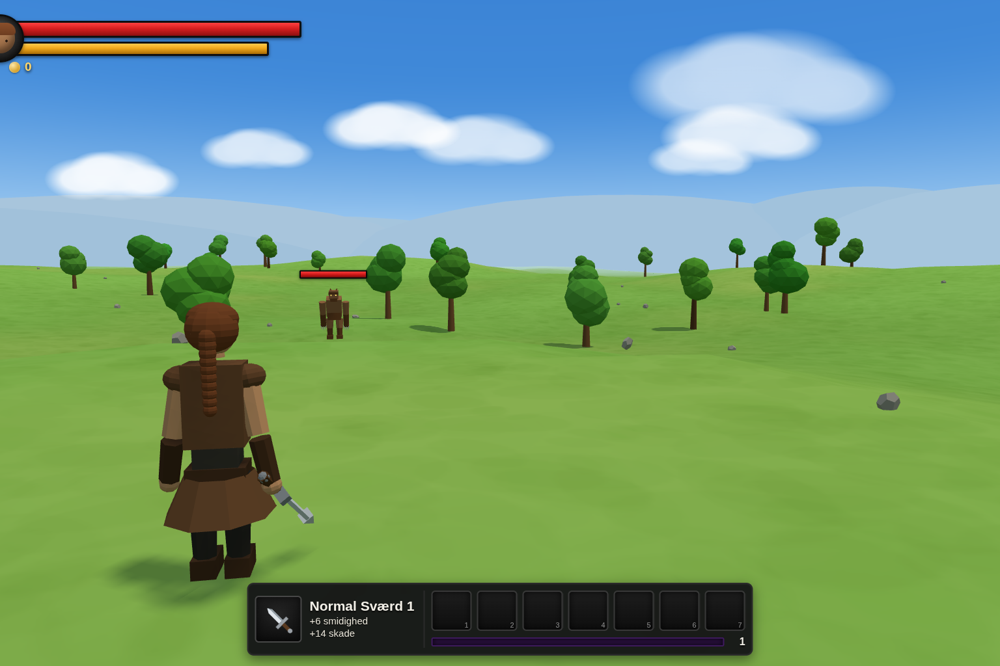
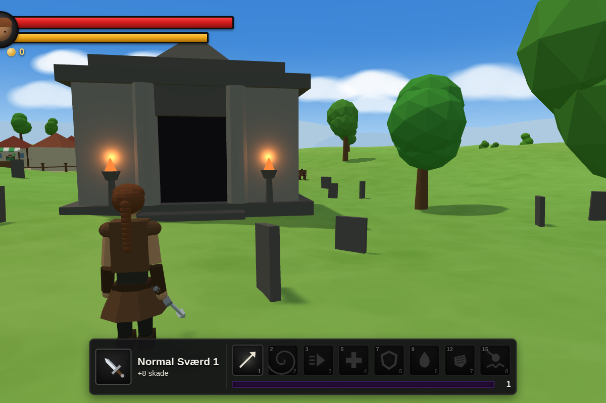
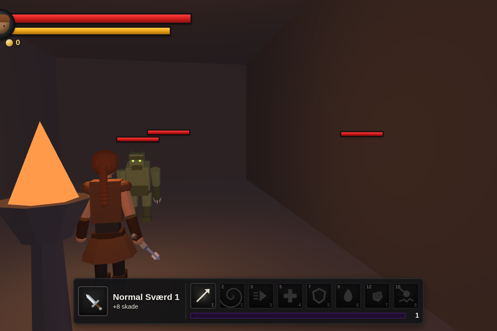
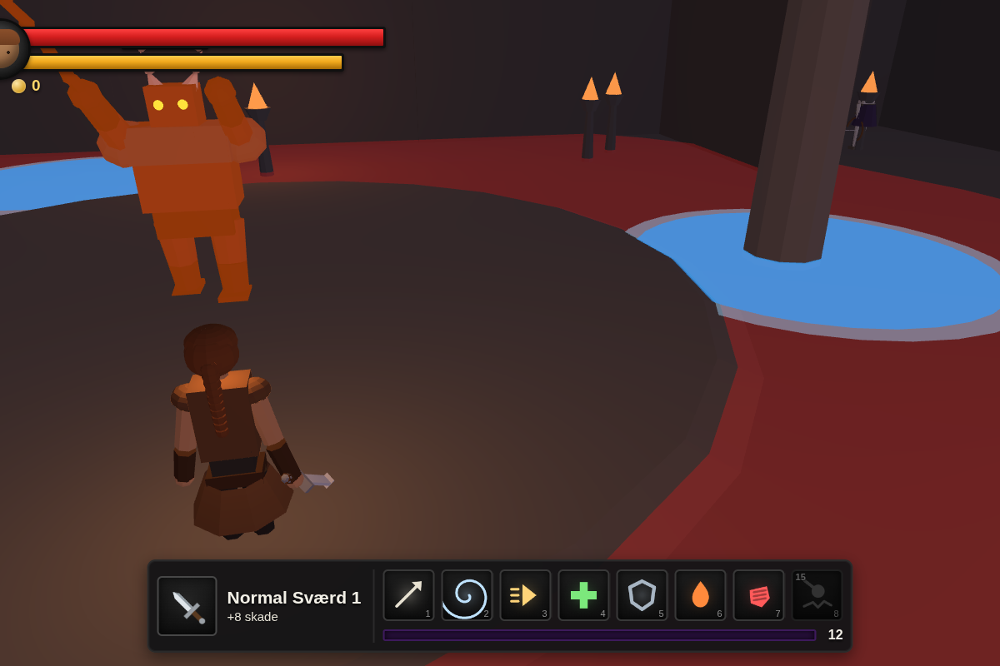
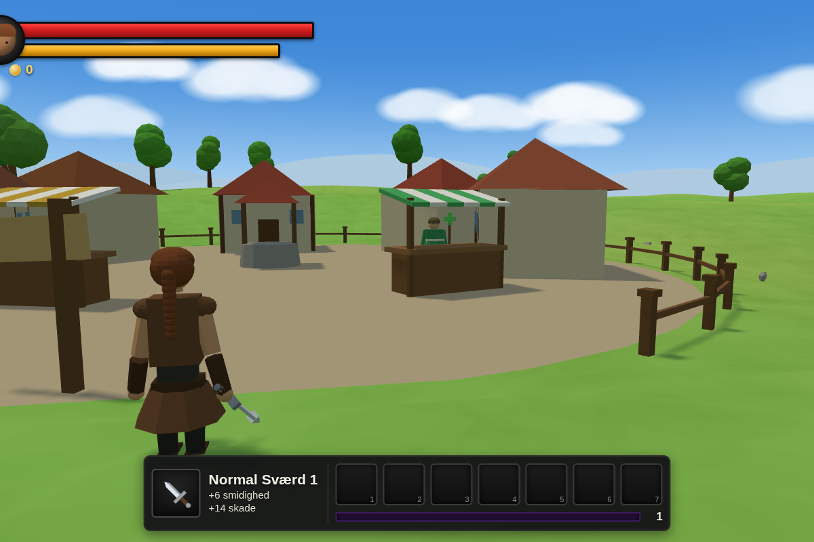
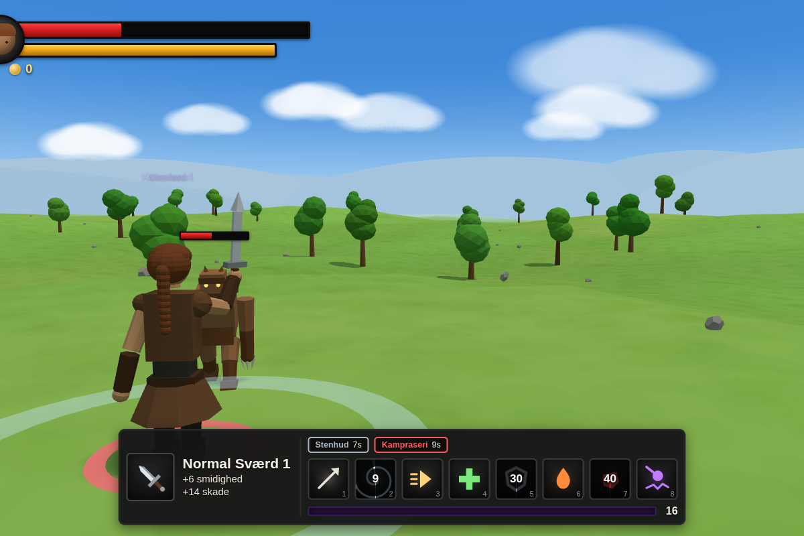
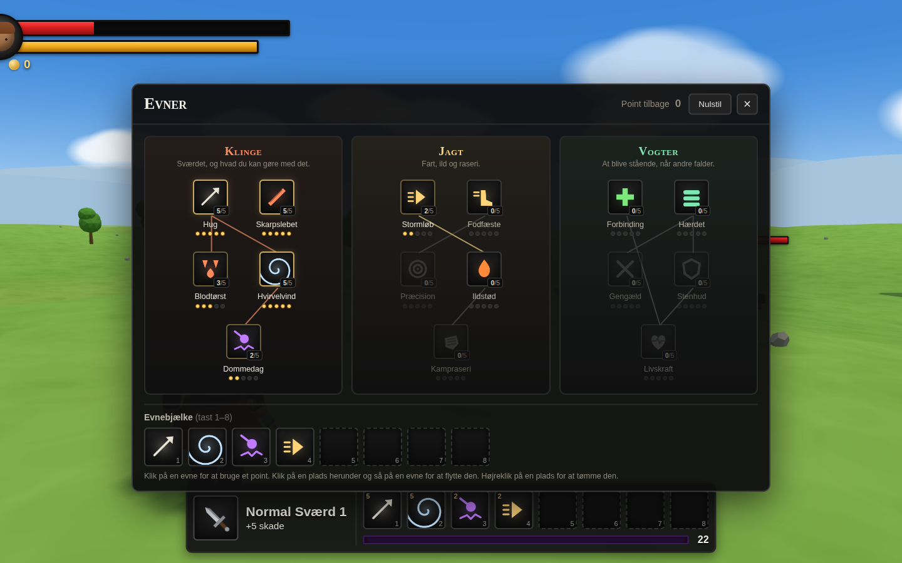

# Devil's Journey

A tiny third-person action-RPG demo built with plain [three.js](https://threejs.org/) —
no build step, no bundler, no install. Kill the monster, pick up better gear, level up.















## Play it

The page uses ES modules, so it needs to be served over http (opening `index.html`
straight off disk will not work).

```bash
npx http-server -p 8099 -c-1 .      # or: python3 -m http.server 8099
# then open http://127.0.0.1:8099/index.html
```

Three.js is vendored in `vendor/three.module.js`, so it runs completely offline.

## Controls

| | |
|---|---|
| `W` `A` `S` `D` | walk |
| mouse | swing the camera around her (click once to lock the cursor; right-drag also works) |
| left click | swing your sword |
| `Shift` | run |
| `I` | open the bag |
| `K` | open the skill tree |
| `E` | talk to the townsfolk |

Doorways need no key — walk into the mausoleum to go down, onto the stairs to come back up.
| `1`–`8` | use an ability |
| `Esc` | pause |

## How it plays

* The meadow is peaceful. The boars grazing there will not touch you — hit one
  and it turns on you until it loses interest, so every fight up top is one you
  picked.
* Real monsters live under the mausoleum out west. Walk in through its doorway
  and you are in the crypt; walk back onto the stairs to come up again.
* Killing anything gives xp and gold. Loot is uncommon — roughly one kill in
  five for a boar, one in three for most crypt dwellers, and a little better
  from a shield guard. The boss always pays out, twice.
* Walk over an item to pick it up — it goes into your bag. Nothing is ever
  swapped onto you: open the bag with `I` and click what you want to wear. A
  drop that beats what you have on says so when you pick it up.
* Every item shows at most three small numbers (`+6 smidighed`, `+14 skade`),
  and rarity is just a colour: grey → green → blue → purple → orange. Most of
  what drops is plain; the good stuff is meant to be a find.
* The sword you start with is the weakest in the game, so your first real drop
  is an upgrade. After that, what drops is judged against the creature you
  killed rather than your own level, which is why the crypt pays better than
  the meadow.
* Fill the purple bar and you level up: more life, more damage, full heal.

### The crypt

A maze of corridors, generated once from a fixed seed so it is the same crypt
every run and worth learning. Every cell is reachable, there are loops rather
than one forced path, and two of the cells open into chambers with a tomb and a
pillar. The hero carries a lantern down there, and braziers mark the junctions.

Nothing sees, shoots, or shows you its health bar through a wall — step around
a corner and an archer loses you. The crypt stays cleared once you kill things
in it; it only repopulates when you leave and come back. Walk back onto the
stairs you arrived on to get out.

Three kinds of thing live in it, and each wants to be fought differently:

* **Skovtrold** — the brute you started the game with. A quick jab that tracks
  you, and a heavy slam it commits to, which you can side-step.
* **Knoglebueskytte** — an archer. It backs away when you close in and looses
  arrows that travel, so keep moving and shut the distance.
* **Skjoldvagt** — a shield guard. Anything you swing at its face barely
  scratches it; get around behind and it folds.

Every wind-up draws a ring on the floor that grows out to that blow's reach and
lands when the ring stops, so the fight is about reading and reacting.

### The Gravherre

Deep in the maze is a hall with a boss in it. He has three moves, all painted on
the floor before they land:

* **Pisken** — his bread and butter: a lane of floor in front of him. It follows
  him while he winds up, then commits, and that gap is when you step off it.
* **Stormløbet** — he marks a long lane, then runs down it. Get out of the lane.
* **Knuset** — the whole hall turns red except three blue rings. Stand in a blue
  ring or take the full hit.

### The skill tree

Press `K`. Three branches — **Klinge** (the sword), **Jagt** (speed, fire and
fury) and **Vogter** (staying upright) — fifteen skills, five ranks each. You get
one point at level 1 and one more every level to a cap of 30, so thirty points
against a tree that costs seventy-five: you will never fill it, which is the
point. Clicking a skill spends a point; `Nulstil` hands them all back, free, so
trying a build costs nothing.

Second and third tiers want a level and a skill above them, and the faint lines
in each column show what feeds what.

Two things make a skill stronger:

* **Ranks.** Rank 1 is the printed number; each rank after adds 18% of it, so
  five ranks is about +72% on their own.
* **Synergies.** Ranks in a *related* skill quietly feed another one, whether or
  not you ever press it. Every point of `Skarpslebet` adds 4.5% to `Hug`; every
  point of `Hvirvelvind` adds 6% to `Dommedag`. The tooltip lists each synergy
  and what it is currently worth.

That is what makes a finished branch worth more than thirty scattered points. At
level 30 a committed blade build lands a `Dommedag` for about four times a
normal monster's whole health; the same thirty points spread across everything
land it for two. Sustained damage comes out close either way — the specialist is
not strictly better, they just hit like a truck once a minute.

The passives feed the character sheet directly: life, weapon damage, crit,
movement and attack speed, lifesteal and regeneration. Open the bag to see the
totals.

### The ability bar

Eight slots on keys `1`–`8`, and eight is the cap. Nothing is on them until you
put it there. A skill you learn drops into the first free slot; to rearrange,
open the tree, click a slot, then click the skill you want in it — right-click a
slot to empty it. Passive skills never go on the bar.

The rank sits in the corner of each slot, a running cooldown sweeps around it
with the seconds left, and timed effects sit as pills above the bar.

### The town

Behind where you start, over the rise, there is a fenced town. Nothing can hurt
you inside the fence: monsters that chase you there are turned away at the
posts, blows do no damage, and you heal faster just standing around. Two people
keep stalls by the gate — walk up and press `E`:

* the **healer** puts you back to full, priced off the life you are missing;
* the **merchant** sells four pieces of gear at your level and buys anything out
  of your bag for about 40% of its worth.

Monsters drop gold as well as gear, which is what pays for both.

The camera is a fixed third-person rig: it orbits a pivot above the hero at a
constant distance, so the mouse swings it around her and never leaves her out
of frame.

## Layout

```
index.html          markup + HUD
src/main.js         game loop, input, combat, camera
src/world.js        terrain, sky, trees, lighting
src/characters.js   hero, monster and weapon meshes (built from primitives)
src/items.js        loot generation and canvas item icons
src/town.js         the town: cottages, stalls, fence and the safe zone
src/abilities.js    what the eight abilities do, and their icons
src/skilltree.js    the tree: nodes, ranks, synergies and the rules (no DOM)
src/monsters.js     one table describing every creature and how it fights
src/dungeon.js      the mausoleum above ground and the crypt below
src/ui.js           HUD, bag, tooltips, floating numbers
tools/shot.mjs      headless screenshot helper
tools/playtest.mjs  headless play-through with assertions
tools/balance.mjs   prints what four builds hit for at each level (plain node)
```

## Checking it still works

```bash
npx http-server -p 8099 -c-1 . &
node tools/playtest.mjs            # asserts movement, combat, loot, levelling
node tools/shot.mjs shots/x.png    # renders a frame to a png
```

`tools/shot.mjs` takes a scenario as its second argument — `start`, `menu`,
`combat`, `walk`, `inventory`, `closeup:<deg>` or `walkclose:<deg>` — and
honours `SHOT_W` / `SHOT_H` for the viewport, which is how the HUD was checked
down to 880x620.
